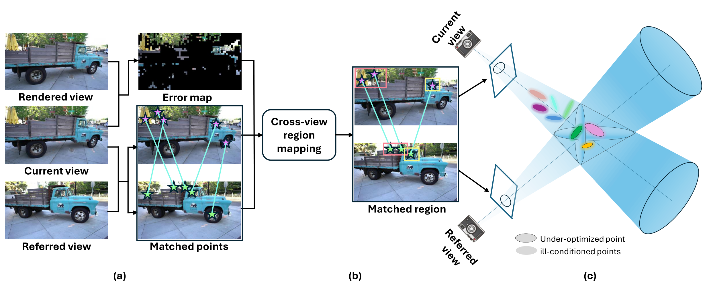

# Gaussian Splatting with Localized Points Management
[Homepage](https://surrey-uplab.github.io/research/LPM/) [Paper](https://arxiv.org/abs/2406.04251)
> [**Gaussian Splatting with Localized Points Management**](https://surrey-uplab.github.io/research/LPM/)           
> Haosen Yang*, Chenhao Zhang*, Wenqing Wang, Marco Volino, Adrian Hilton, Li Zhang, Xiatian Zhu  
> **Arxiv preprint**


**This repository is the official implementation of "Gaussian Splatting with Localized Points Management".** In this paper, we propose a Localized Point Management (LPM) strategy, capable of identifying those error-contributing zones in the highest demand for both point addition and geometry calibration.  Serving as a versatile plugin, LPM can be seamlessly integrated into existing 3D Gaussian Splatting models.

## Updates
- **`2024/06/14`**: Code is available Now!

## 🛠️ Pipeline



## Get started

### Environment

The hardware and software requirements are the same as those of the [3D Gaussian Splatting](https://github.com/graphdeco-inria/gaussian-splatting), which this code is built upon. To setup the environment, please run the following command:

```shell
# Install 3DGS enviroment
git clone https://github.com/Surrey-UPLab/Localized-Gaussian-Point-Management.git
cd Localized-Gaussian-Point-Management
conda env create --file environment.yml
conda activate lpm
# Install LightGlue enviroment
git clone https://github.com/cvg/LightGlue.git && cd LightGlue
python -m pip install -e .
```

### Data preparation

Create a ```data/``` older within the project directory by
```
mkdir data
```
Organize the datasets as follows:
```
data/
├── dataset_name
│   ├── scene/
│   │   ├── images
│   │   │   ├── IMG_0.jpg
│   │   │   ├── IMG_1.jpg
│   │   │   ├── ...
│   │   ├── sparse/
│   │       └──0/
...
```

#### Public Data
The MipNeRF360 scenes are provided by the paper's author and can be accessed [here](https://jonbarron.info/mipnerf360/). The SfM datasets for Tanks & Temples and Deep Blending are hosted by 3D-Gaussian-Splatting and are available for download [here](https://repo-sam.inria.fr/fungraph/3d-gaussian-splatting/datasets/input/tandt_db.zip). Please download and extract them into the `data/` folder.

#### Custom Data
For custom data, process the image sequences using [Colmap](https://colmap.github.io/) to obtain SfM points and camera poses. Place the resulting files into the `data/` folder.

### Running

After installation and data preparation, you can train  and evaluate the model.
**Training**:
```shell
python train.py -s <dataset path> --eval --m <model path>  \
--densify_from_iter 500 --densify_until_iter 15000 \
--reset_from_iter 500 --reset_until_iter 15000 \
--densification_interval 100 --reset_interval 100 \
--angle 45
```
**Note:** For indoor scenes, we suggest using less frequent resets and a larger neighbor angle, hence setting reset_interval to 200 and angle to 90. For outdoor scenes, use the default settings. You can modify these settings to fit your specific scene needs.

**Render and Evaluation**:
```shell
python render.py -m <model path>
python metrics.py -m <model path>
```

## 📜 BibTex
```bibtex
@article{yang2024localized,
  title={Gaussian Splatting with Localized Points Management},
  author={Yang, Haosen and Zhang, Chenhao and Wang, Wenqing and Volino, Marco and Hilton, Adrian and Zhang, Li and Zhu, Xiatian},
  journal={arXiv preprint arXiv:2406.04251},
  year={2024}
}
}
```